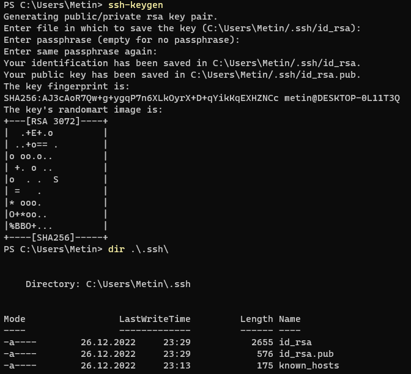
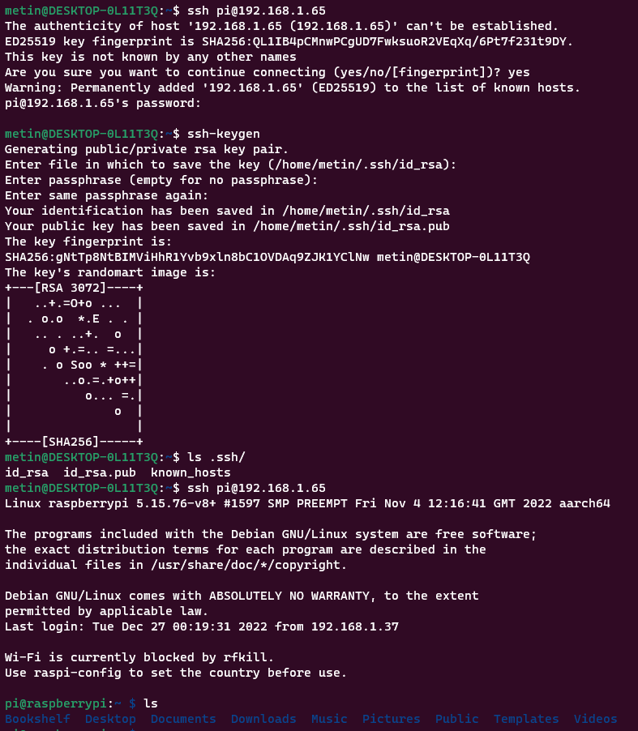
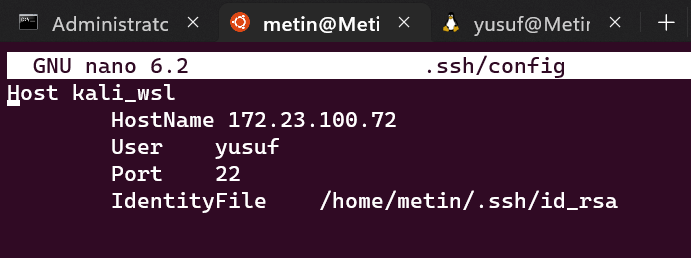
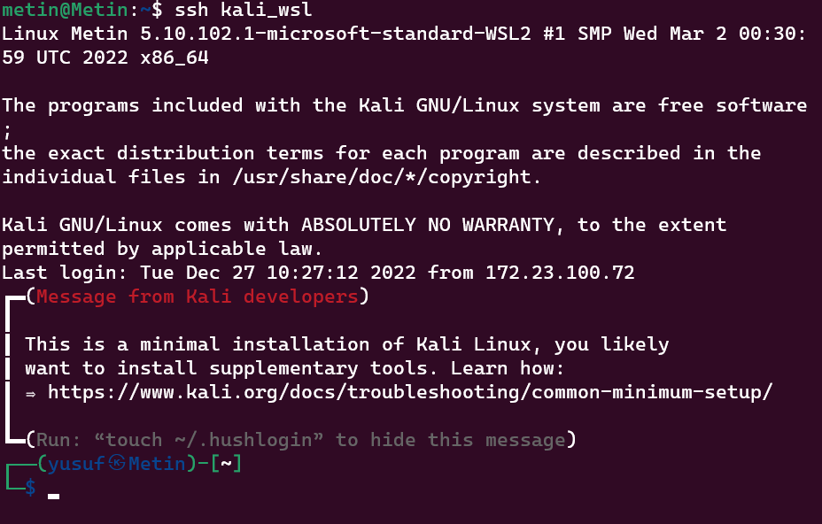
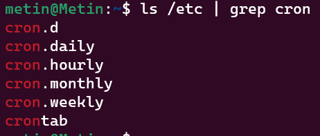
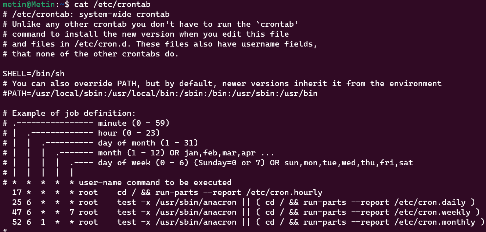
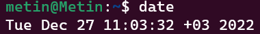

# 4. DERS
---
## Server Nedir ?
Vikipedi tanımına göre:
Server (Sunucu), farklı program ya da cihazlara (clients) hizmet sağlayan donanımsal ya da yazılımsal bilgisayar parçalarıdır. Sunucular "servis(services)" olarak adlandırılan çeşitli işlevler sağlarlar. Örnek olarak birden çok alıcı arasında veri ve kaynak paylaşımı ya da clientlar için hesaplamalar yapabilir.

Yani sunuculara da bir bilgisayardır. 

Tabi evimizdeki bilgisayarlara nazaran bu bilgisayarların internet üzerindeki yüzlerce ya da binlerce kulanıcıya, kaynaklarını ve verilerini hızlı bir şekilde işlemeye ve iletmeye ihtiyacı olduğundan çoğu alanda üstün performansa sahip olmalılardır.

Peki bizim bilgisayarlardan server olmaz mı? Elbette olabilir. Ama bir veri merkezinde bulunan sunucu kadar client'ı kaldıramayacaktır. 

İşte bu yüzden bu özelleşmiş sunucu donanımları ve yazılımları kullanıcılara sunulmaktadır.

Tipik serverlara veri tabanı sunucuları, dosya sunucuları, mail sunucuları, yazdırıcı sunucuları, web sunucuları, oyun ve uygulama yazıcıları örnek verilebilir.


---
## SSH Protokolü

Serverlar fiziksel donanımlar olsalar da her zaman fiziki olarak yanlarında olamamıza gerek yoktur :). Sunuculara uzaktan müdahelede bulunabilmemiz için SSH'ı (Secure Shell Protocol) kullanabiliriz.

SSH, bizlerim sunuculara uzaktan güvenli bir şekilde erişim yapmamızı ve dosyalarımızı aktarmamıza yarar. 

Yani internet üzerinden bu protokolü kullanarak uzaktaki başka bir bilgisayara (sunucuya) bağlanabiliriz.

SSH, komut olarak çoğu GNU/Linux dağıtımlarında ve Windows'ta kurulu olarak gelmektedir. Genel kullanımı şu şekildedir:

``` bash
ssh kullanıcıAdı@SunucuAdresi
```


SSH varsayılan olarak 22. port üzerinde çalışsa da çoğu zaman güvenlik amacıyla (nmap vb. port tarama araçları tarafından kolayca fark edilmemesi için) bu port farklı bir porta atanır-değiştirilir.
Bunun için de -p seçeneğini kullanabiliriz:

``` bash
ssh -p 48258 kullanıcıAdı@SunucuAdresi
```

Ayrıca Windows'ta çok bilinen ve kullanılan, hatta Mr. Robot'ta bile gözüken "[PuTTY](https://www.putty.org/)" adlı yazılımı kullanabilirsiniz.

---
Yukarıda şifre ile giriş yapmayı öğrendik ancak bunu güvenli bir giriş yöntemi olarak görmemeliyiz. Çünkü SSH üstünde bruteforce şifre kırma yöntemleri kullanılabilir ya da sistemimizde keylogger işlevli donanım ve yazılımlar mevcut olabilir.

Şifre kullanmak yerine de sunuculara erişim sağlarken "ssh-key"lerini kullanıyoruz.

SSH-Key'lerini oluşturmak için `ssh-keygen` komutunu kullanıyoruz. Bize bu keyleri nereye kaydedeceğimizi ve oluşturulan keyler için şifremizi isteyecektir.


Sonucunda iki adet key dosyamız oluşacaktır: public ve private.
public olan id_rsa.pub dosyası iken private olan uzantısız id_rsa'dir.

Bu public key'i bağlanacağımız serverlara eklemeliyiz ancak private keyi saklayarak sadece server'a bağlanacağımız sistemde kalmalıdır.

Server'a keyleri manual eklemek yerine bizim yerimize otomatik gerçekleştirecek olan komut `ssh-copy-id`dir.
Bu komut bizim public key'imizi karşıdaki ssh sunucusuna yollayıp kaydedecektir.

Varsayılan kaydetme yolu:

``` bash
~/.ssh/authorized_keys
```


``` bash
ssh-copy-id  kullanıcı_adı@server_IP

```


SSH keylerimizi oluşturduktan ve servera ekledikten sonra giriş için yine aynı komutu kullanabiliriz:

``` bash
ssh kullanıcı_adı@server_IP
```

Eğer varsayılan konumdan farklı bir konumda key dosyaları bulunuyorsa `-i` parametresi ile yolu belirtmeliyiz.

``` bash
ssh -i /home/metin/sshtest/ -p 123 kullanıcı_adı@server_IP
```

---

### SSH Ayarları

`~/.ssh/config` dosyası oluşturarak her seferinde kullanıcı adı ve server IP'sini girme yükümlülüğünden kurtulabiliriz. Bu dosya sayesinde `ssh someserver` gibi bir komutla erişim sağlayabiliriz.

Dosyanın yapısı şu şekildedir.

```
Host	server_name
		HostName			server_ip
		User				username
		Port				22
		IdentityFile		/path/to/ssh-key
```



---
## Zamanlanmış Görevler

Zamanlanmış görevler ile belirli periyodlar dahilinde manuel yapmanız gereken işleri otomatik olarak istenen zamanlarda gerçekleşmesini sağlayabilirsiniz.

İşletim sistemlerinde çoğunlukla kurulu olarak gelen ve bu periyodik işlerimizi üstlenen araca **cron** diyoruz.
Cron görevleri dosyalarını /etc altında bulabilirsiniz:



---
## Cron

Cron, komutlarımızı periyodlar halide çalıştırmamıza yarayan bir daemon'dur(Arka planda çalışarak başka sistemi gözetleyen ya da diğer işlemlere işlevler sağlayan servis prosesleri). 

Cron'u iki şekilde kullanabiliriz:

1. Yukarıda ekran görüntüsünü koyduğum şekildeki gibi cron.daily, weekly vb. klasörlerinin içine scriptler konularak kullanımı.

2. Kullanıcıya özel crontab dosyası oluşturarak kullanımı.

---
### Sunucu Saat Ayarları
Zamanlanmış görevler yürüteceğimiziden sistem zaman ayarlarından emin olmamız gerekir.

Sistem saatini aşağıdaki komutla görebilirsiniz:
``` bash
date
```

Eğer bir yanlışlık olduğunu düşünüyorsanız sistem saatini ayarlayabilirsiniz:
``` bash
dpkg-reconfigure tzdata
```
___

### Crontab Kullanımı

Her kullanıcıya ait fatklı crontab dosyası vardır. `crontab` komutu ile bir crontab dosyası `/var/spool/cron/crontabs/` dizini içerisine oluşturulur.Bu dosyalar üzerinde manual değişiklik yapılmaz, `crontab` komutu kullanılır.


| Komut | Açıklama |
|:-----:|:--------:|
| **`crontab -l`** | Mevcutsa komudu çalıştıran kullacının crontab dosyasını gösterir. |
| **`crontab -e`** | Kullanıcının crontab dosyasını açar, yoksa oluşturur. |
| **`crontab -r`** | Kullanıcının crontab dosyasını siler. |
| **`crontab -u user_name -e`** | Başka bir kullanıcının crontab dosyasını açar |

`crontab -e` komutu ile açılan dosyaya, her satıra bir işlem yazılacak şeklinde dosyanın sonuna eklemeler ya da değişiklikler yapılır. Dosyayı kaydedip çıkıldığından bu değişiklikler işleme konulur.

Satırlar aşağıdaki biçimde olmalıdır.

```
.---------------- dakika (0 - 59)
|  .------------- saat (0 - 23)
|  |  .---------- Ayın Günleri (1 - 31)
|  |  |  .------- Ay (1 - 12)
|  |  |  |  .---- Haftanın Günleri (0 - 6) (Pazar=0 ya da 7)
|  |  |  |  |
*  *  *  *  *  Çalıştırılacak komut

```
**Örnek:** 
```
Her 10 dakikada bir log.sh scripti çalışır.

*/10 * * * * /home/metin/scripts/log.sh
```
```
Her gün saat 6 ve 23'te çalışır.

00 6,23 * * * touch ~/report.txt
```
```
9:30 ve 18:30 arasında her saat çalışır.

30 09-18 * * * /komut/yada/script
```
```
Her Pazar günü gece yarısı komutu çalıştırır.
0 0 * * 0 ls
```
Bir de özel yapılar mevcut onları inceleyelim:
|Özel Yapılar|Karşılıkları|Açıklama|
|:----:|:-----:|:----:|
|`@yearly`|0 0 1 1 *| Her yılın ilk günü
|`@monhtly`|0 0 1 * * | Her ayın ilk günü
|`@weekly`|0 0 * * 0| Her hafta Pazar günü 
|`@daily`|0 0 1 1 *| Her gün geceyarısı
|`@hourly`|0 0 1 1 *| Her saatin başlangıcı
|`@reboot`|--| Her sistem başlatıldığında


____
## Uygulama 
Bu hafta işlediğimiz SSH ve cron bilgilerini birleştirerek bir bash scripti yazabiliriz.

Şimdi WSL'de de göstereceğim üzere, Ubuntu makinemiz üzerindeki **Database_backup** isimli klasörümüze Kali Linux üstünde yer veri tabanı dosyalarını (**Database**) her hafta Pazartesi günü saat 20:45'te kopyalamak istiyoruz.

Bu bir makineden diğerine dosylarımızı ya da klasörlerimizi kopylamak için `scp` komutunun kullanacağız. Bu komut ssh protokolü üzerinden dosya aktarımı yapmamızı sağlamaktadır.

Komutun kullanımı şu şekildedir: (-r seçeneği klasör kopyalama için kullanılır. / -P seçeneği port belirtmek için)
``` bash
# Server to client
scp -i /public/key/path/on/client server_username@server_ip:/source/server /destination/client
```

``` bash
# Client to server
scp -i /public/key/path/on/client /path/to/file server_username@server_ip:/destination/on/server
```

``` bash
#!/bin/bash
username="USERNAME_ON_SERVER"
server_ip="SERVER_IP"
key_path="${HOME}/.ssh/authorized_keys"
remote_path="Database"
local_path="${HOME}/Database_backup/"

scp -i ${key_path} -r ${username}@${server_ip}:${remote_path} ${local_path}
```
___
Ders bitti...
## Python Üzerinden Modül Kurma 
* `pip` komutu


---
### Faydalı Kaynaklar

* https://www.gokhanmankara.com/2010/06/crontab-kullanimi-ve-ornek-crontab-uygulamasi/

* https://github.com/PauSiber/gnulinux/blob/master/hafta3/hafta3.md

* https://www.hanselman.com/blog/how-to-ssh-into-a-windows-10-machine-from-linux-or-windows-or-anywhere

* https://www.youtube.com/watch?v=KbVcRQQ9PNw&t=259s

* https://github.com/winfsp/sshfs-win